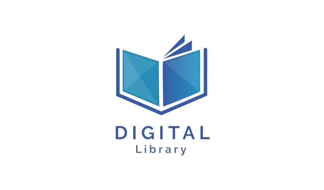
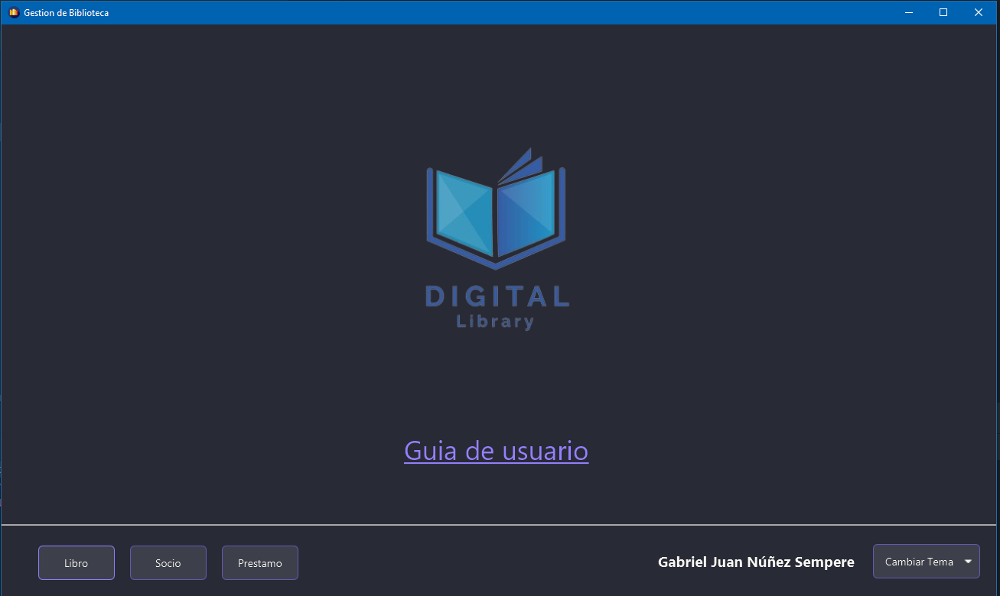
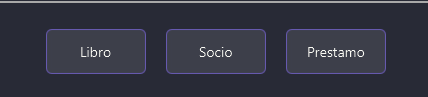
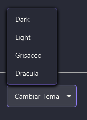

# 
Digital Libray - Guia de usuario

 

  

> 
 Bienvenido a la guia de usuario de Digital Library, en esta guia le guiaremos por el manejo y uso de las distintas funciones que se ofrecen.

---

Al abrir la aplicacion se encontrara con el menu principal.

Donde podra acceder a las tres secciones principales: Libro, Socio Y Prestamo.

En la esquina inferior derecha podra cambiar el tema por una serie de temas predefinidos si asi lo desea, este boton permancera en todas las vistas principales.

---
# Seccion Libros
asd

## A
### **Texto en negrita** __Otro texto en negrita__

# *Texto en itálica*
# _Otro texto en itálica_

> Aquí hay una cita.

---
***
___

~~Texto tachado~~

:smile:
:rocket:
:octocat:
